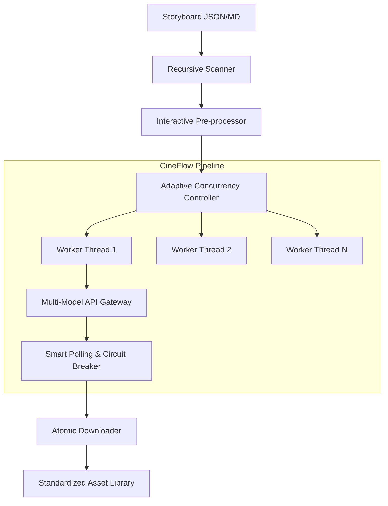

# 🌊 CineFlow - Universal Video Generation Pipeline

[](https://www.python.org/)
[](LICENSE)
[]()

[**中文文档 (Chinese Docs)**](README_zh.md)

**CineFlow** is a specialized tool designed to automate and manage large-scale video generation tasks. It provides a structured pipeline for interacting with video generation APIs, ensuring stability and efficiency in batch production environments.

By focusing on error handling, concurrency control, and asset management, CineFlow helps creators and developers move from manual one-off generations to reliable, automated workflows.

---

## ⚠️ Disclaimer

**Core Driver: [Sora.hk](https://www.sora.hk/) API**

> This project is currently primarily based on the API provided by the third-party service provider Sora.hk, and is NOT a direct service from OpenAI. While the interface format is compatible with the NewAPI standard, there are differences in model parameters (e.g., `is_pro`), billing strategies, and network connectivity. Please read the service provider's documentation carefully before using it in a production environment.

---

## 🏗 Architecture



---

## ✨ Key Features

### 🛡️ Industrial Stability
*   **Adaptive Circuit Breaker**: Defaults to **20 concurrent tasks**. Automatically downgrades to **Safe Mode (5 tasks)** upon API fluctuations (429/5xx) and executes an exponential cooling recovery strategy.
*   **Jitter Protection**: Introduces microsecond-level random jitter at task startup to smooth out network spikes.
*   **Atomic Writes**: Uses a `.tmp` transition writing mechanism combined with disk space detection to prevent file corruption.

### ⚡️ Efficient Workflow
*   **Resumable Generation**: Intelligently skips completed files to save valuable API quotas.
*   **Long-Running Task Optimization**: Long-polling strategy optimized for Pro models (generation time > 10 mins), supporting up to **35 minutes** of wait time.
*   **Interactive Wizard**: Built-in CLI wizard supporting **Character ID injection**, **Resolution override**, and other pre-processing operations.

### 🔧 Developer Friendly
*   **Full Traceability**: Records Request IDs for easy troubleshooting.
*   **Log Sanitization**: Automatically filters sensitive information like API Keys to ensure open-source security.
*   **Multi-Platform Support**: Provides one-click startup scripts for macOS/Linux (`.sh`) and Windows (`.bat`).

---

## 🗺️ Roadmap

### 🚀 Phase 1: Foundation (Current)
- [x] Deep adaptation for Sora.hk interface
- [x] Multi-threaded concurrency & circuit breaker mechanism
- [x] Storyboard standardization & auto-completion
- [x] Interactive CLI Wizard

### 🛠️ Phase 2: Multi-Modal Expansion (Next)
- [ ] **Multi-Provider Support**: Adapt for [T8Star AI](https://ai.t8star.cn) and [AIHubMix](https://aihubmix.com).
- [ ] **Multi-Model Aggregation**: Support Nano Banana Pro, Grok Imagine, Veo 3.1, Wan 2.6.
- [ ] **Cloud Asset Management**: Integrate image hosting tools for automatic local `image_url` uploading.
- [ ] **Multi-Reference Matrix**: Auto-stitch "Character + Scene" matrix images to overcome single reference limits.

### 🤖 Phase 3: Intelligence & GUI (Future)
- [ ] **LLM Script Assistant**: Auto-decompose novels/scripts into standardized JSON storyboards (LLM integration).
- [ ] **CineFlow Studio**: Cross-platform GUI client (Electron/Flutter) for visual orchestration.

---

## 🛠️ Installation & Usage

### Prerequisites
*   **Python 3.10+** (3.10 or 3.11 recommended for best stability)
*   Git

### Option 1: Quick Start (Recommended)

No manual environment configuration needed. The script automatically creates a virtual environment (venv) and installs dependencies.

**macOS / Linux:**
```bash
git clone https://github.com/XucroYuri/CineFlow.git
cd CineFlow
./start_mac.sh
```

**Windows:**
Double-click `start_win.bat` in the directory.

### Option 2: Manual Installation

If you prefer Conda or managing venv manually:

```bash
# 1. Clone repository
git clone https://github.com/XucroYuri/CineFlow.git
cd CineFlow

# 2. Create and activate venv (Recommended)
python3 -m venv venv
source venv/bin/activate  # Windows: venv\Scripts\activate

# 3. Install dependencies
pip install -r requirements.txt
```

---

## ⚙️ Configuration

1.  Copy the configuration template:
    ```bash
    cp .env.example .env
    ```
2.  Edit `.env` and enter your API Key:
    ```ini
    SORA_API_KEY=sk-xxxxxxxxxxxxxxxxxxxx
    # Optional: Proxy
    # HTTP_PROXY=http://127.0.0.1:10808
    ```

---

## 🚀 Advanced Usage

### 1. Wizard Mode
Run the program directly to enter the full-featured wizard, guiding you from input selection to output configuration:
```bash
python main.py
```

### 2. Dry Run
Check storyboard formats and estimate costs without consuming any quota:
```bash
python main.py --dry-run
```

### 3. In-Place Production
Save generated videos directly to an `_assets` directory alongside the source Markdown/JSON files, facilitating management in tools like Obsidian:
```bash
python main.py --input-dir "/Your/Obsidian/Vault/Project" --output-mode in_place
```

---

## 📂 Directory Structure

```text
CineFlow/
├── input/                  # Default Input Area (Includes Templates)
├── output/                 # Default Output Area
├── src/
│   ├── api_client.py       # API Gateway (Connection Pool/Retry)
│   ├── concurrency.py      # Adaptive Concurrency Controller
│   ├── worker.py           # Task Pipeline Logic
│   ├── interactor.py       # CLI Interaction Module
│   └── normalize_script.py # Data Normalization Script
├── main.py                 # Entry Point
├── start_mac.sh            # macOS/Linux Startup Script
└── start_win.bat           # Windows Startup Script
```

## 🤝 Contributing

Issues and Pull Requests are welcome!
Before submitting code, please ensure:
1.  Run `python main.py --dry-run` to verify no errors.
2.  Do NOT submit `.env` files containing real API Keys.

## 📝 License

This project is licensed under the [MIT License](LICENSE).