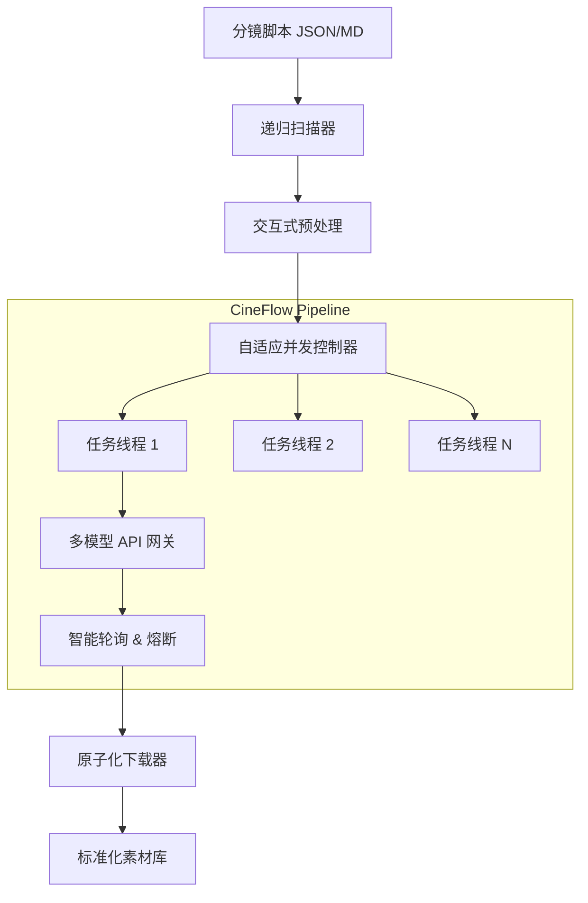

# 🌊 CineFlow (影流) - 通用视频生成流水线

[](https://www.python.org/)
[](LICENSE)
[]()

[**English Documentation**](README.md)

**CineFlow (影流)** 是一个旨在自动化管理大规模视频生成任务的开源工具。它通过统一的流程编排，整合多种视频生成 API（如 Sora, Veo, Wan 等），为批量生产环境提供稳定、高效的执行保障。

CineFlow 专注于解决批量生成中的异常处理、并发控制和资产管理等核心痛点，帮助创作者和开发者从繁琐的手动操作转向可靠的自动化流水线。

---

## ⚠️ 服务说明 (Disclaimer)

**当前版本核心驱动：[Sora.hk](https://www.sora.hk/) API**

> 本项目目前主要基于第三方服务商 Sora.hk 提供的 API 开发，并非 OpenAI 官方直连服务。虽然接口格式兼容 NewAPI 标准，但在模型参数（如 `is_pro`）、计费策略和网络连接性上存在差异。请在生产环境中使用前仔细阅读服务商文档。

---

## 🏗 系统架构 (Architecture)



---

## ✨ 核心特性 (Features)

### 🛡️ 工业级稳定性
*   **自适应熔断 (Circuit Breaker)**: 默认 **20 并发**。遇 API 波动（429/5xx）自动降级至 **安全模式（5 并发）**，并执行指数级冷却恢复策略。
*   **防惊群 (Jitter)**: 任务启动引入微秒级随机抖动，平滑网络尖峰。
*   **原子写入**: 采用 `.tmp` 过渡写入机制，配合磁盘空间检测，杜绝文件损坏。

### ⚡️ 高效流程
*   **断点续传**: 智能跳过已生成的完整文件，节省宝贵的 API 额度。
*   **长时任务优化**: 针对 Pro 模型（生成耗时 >10分钟）优化的长轮询策略，支持最长 **35 分钟** 等待。
*   **交互式向导**: 内置 CLI 向导，支持**角色 ID 注入**、**分辨率统一覆盖**等预处理操作。

### 🔧 开发者友好
*   **全链路追踪**: 记录 Request ID，便于故障排查。
*   **日志脱敏**: 自动过滤 API Key 等敏感信息，保障开源安全。
*   **多平台支持**: 提供 macOS/Linux (`.sh`) 和 Windows (`.bat`) 一键启动脚本。

---

## 🗺️ 路线图 (Roadmap)

### 🚀 Phase 1: 基础夯实 (Current)
- [x] Sora.hk 接口深度适配
- [x] 多线程并发与熔断机制
- [x] 分镜脚本标准化与自动补全
- [x] 交互式 CLI 向导

### 🛠️ Phase 2: 多模态扩展 (Next)
- [ ] **多服务商接入**: 适配 [贞贞的AI工坊](https://ai.t8star.cn) 和 [推理时代](https://aihubmix.com)。
- [ ] **多模型聚合**: 支持 Nano Banana Pro, Grok Imagine, Veo 3.1, Wan 2.6。
- [ ] **本地资产上云**: 集成图床工具，自动处理本地 `image_url` 上传。
- [ ] **多参考图矩阵**: 自动拼接“角色+场景”矩阵图，突破单参考图限制。

### 🤖 Phase 3: 智能化与 GUI (Future)
- [ ] **LLM 编剧助理**: 输入小说/剧本，自动拆解为标准化 JSON 分镜（集成 LLM）。
- [ ] **CineFlow Studio**: 跨平台 GUI 客户端 (Electron/Flutter)，提供可视化编排。

---

## 🛠️ 安装与使用 (Installation)

### 前置要求
*   **Python 3.10+** (推荐 3.10 或 3.11 以获得最佳稳定性)
*   Git

### 方式一：极简启动 (推荐)

无需手动配置环境，脚本会自动创建虚拟环境 (venv) 并安装依赖。

**macOS / Linux:**
```bash
git clone https://github.com/XucroYuri/CineFlow.git
cd CineFlow
./start_mac.sh
```

**Windows:**
直接双击运行目录下的 `start_win.bat`。

### 方式二：开发者手动安装

如果您习惯使用 Conda 或手动管理 venv：

```bash
# 1. 克隆项目
git clone https://github.com/XucroYuri/CineFlow.git
cd CineFlow

# 2. 创建并激活虚拟环境 (建议)
python3 -m venv venv
source venv/bin/activate  # Windows: venv\Scripts\activate

# 3. 安装依赖
pip install -r requirements.txt
```

---

## ⚙️ 配置指南 (Configuration)

1.  复制配置模板：
    ```bash
    cp .env.example .env
    ```
2.  编辑 `.env` 文件，填入您的 API Key：
    ```ini
    SORA_API_KEY=sk-xxxxxxxxxxxxxxxxxxxx
    # 可选：配置代理
    # HTTP_PROXY=http://127.0.0.1:10808
    ```

---

## 🚀 进阶用法 (Advanced Usage)

### 1. 交互式向导 (Wizard Mode)
直接运行程序即可进入全功能向导，引导您完成从输入选择到输出配置的全过程：
```bash
python main.py
```

### 2. 空跑估价 (Dry Run)
在不消耗任何额度的情况下，检查分镜格式并估算成本：
```bash
python main.py --dry-run
```

### 3. 原位生产模式
将生成的视频直接保存在 Markdown/JSON 文件同级的 `_assets` 目录下，便于 Obsidian 等笔记软件管理：
```bash
python main.py --input-dir "/Your/Obsidian/Vault/Project" --output-mode in_place
```

---

## 📂 目录结构

```text
CineFlow/
├── input/                  # 默认输入区 (含标准模板)
├── output/                 # 默认输出区
├── src/
│   ├── api_client.py       # API 网关 (连接池/重试)
│   ├── concurrency.py      # 自适应并发控制器
│   ├── worker.py           # 任务流水线逻辑
│   ├── interactor.py       # CLI 交互模块
│   └── normalize_script.py # 数据标准化脚本
├── main.py                 # 程序入口
├── start_mac.sh            # macOS/Linux 启动脚本
└── start_win.bat           # Windows 启动脚本
```

## 🤝 贡献 (Contributing)

欢迎提交 Issue 和 Pull Request！
在提交代码前，请确保：
1.  运行 `python main.py --dry-run` 测试无误。
2.  不要提交包含真实 API Key 的 `.env` 文件。

## 📝 License

本项目采用 [MIT License](LICENSE) 开源。
